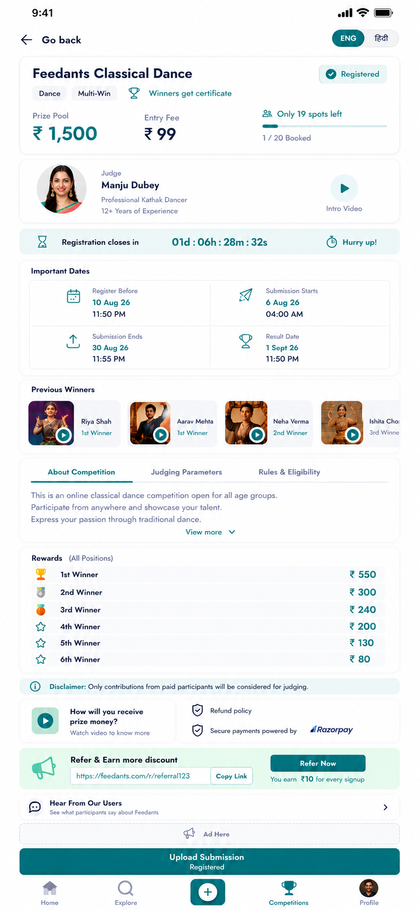

# 🏆 Feedants - Competition Details Screen
### Full-Stack Technical Assignment | Full Stack Development Internship

A production-grade, functional full-stack implementation of the **Feedants Competition Details Screen** built with **React Native (Web & Mobile)**, **Node.js**, **Express.js**, and **MongoDB**.

This module is not merely a static UI replica; it is a **dynamic, lifecycle-driven system** designed with concurrency safeguards, atomic slot reservations, bilingual localization (English & Hindi), dynamic user states, and interactive workflows.

---

## 📸 Design Reference & Fidelity

| Provided Design Reference | Implementation Highlights |
| :--- | :--- |
|  | • **Pixel-Perfect Alignment**: Exact colors (`#005963`, `#00838F`), font weights, badges, and layout hierarchy.<br>• **100% Dynamic**: Every single metric, label, date, winner, and rule is fetched from MongoDB.<br>• **Dual Platform**: Runs seamlessly on **Web** (`localhost:8081`) and **Mobile** via Expo Go. |

---

## 🛠️ Technology Stack

| Layer | Technologies Used | Rationale |
| :--- | :--- | :--- |
| **Frontend** | **React Native** (Expo SDK 52), `react-native-web`, `@expo/vector-icons` | Cross-platform codebase delivering native mobile performance and instant browser accessibility. |
| **Backend** | **Node.js (v20+)**, **Express.js** | Lightweight, high-throughput asynchronous event-driven RESTful API. |
| **Database** | **MongoDB**, **Mongoose ODM** | Document-oriented schema ideal for complex nested competition structures (judging criteria, rewards, winners). |
| **In-Memory Fallback** | `mongodb-memory-server` | **Zero-config evaluation**: Automatically starts an in-memory MongoDB instance if no local MongoDB URI is provided! |

---

## 🌟 Key Functional Capabilities

### 1. Dynamic Competition Lifecycle Engine
The competition state dynamically advances through its lifecycle based on timestamps and spot capacity:
- **`REGISTRATION_OPEN`**: Registration is active; countdown timer ticks live; users can register.
- **`REGISTRATION_CLOSED`**: Deadline reached or slots filled (Housefull); CTA updates to disabled.
- **`SUBMISSIONS_OPEN`**: Registered participants can upload performance videos.
- **`SUBMISSIONS_CLOSED`**: Judging phase begins; submissions locked.
- **`COMPLETED`**: Results declared and previous winners published.

### 2. High-Concurrency & Atomic Slot Booking
To prevent overbooking race conditions when thousands of users register simultaneously:
```javascript
// Concurrency-safe atomic reservation with capacity guard
const updatedComp = await Competition.findOneAndUpdate(
  {
    _id: competitionId,
    $expr: { $lt: ['$bookedSpots', '$maxSpots'] } // Atomic condition
  },
  { $inc: { bookedSpots: 1 } }, // Atomic increment
  { new: true }
);
if (!updatedComp) {
  return res.status(409).json({ message: "All spots were just booked!" });
}
```
- Eliminates dirty reads and overselling without heavy distributed table locks.

### 3. User Registration & Dynamic State Machine
The bottom sticky CTA button and screen state react instantly to the active user:
- **Unregistered User**: Shows `Register Now • ₹99` with remaining spot indicator (`Only 19 spots left`). Opens mock Razorpay checkout modal.
- **Registered User**: Displays green `✔ Registered` badge on top header and changes CTA to `Upload Submission`.
- **Submitted User**: Updates CTA to `View Submission (Submitted & Under Review)`.

### 4. Interactive Video Preview & Media Player
- Clicking the **Intro Video** button on the Judge card (`Manju Dubey`) opens an embedded video modal.
- Clicking on any **Previous Winner** card (`Riya Shah`, `Aarav Mehta`, `Neha Verma`, `Ishita Chouhan`) launches their winning performance video preview.

### 5. English & Hindi Bilingual Localization
- Instant toggle (`ENG` / `हिंदी`) in the top navigation bar.
- Changes headers, badge texts, dates, judging parameters, rules, and disclaimer into fluent Hindi or English.

### 6. Built-In Evaluator Testing Toolbar (DevTools)
Click the **options/settings icon (⚙️)** in the top header to reveal evaluator controls:
- **Switch User**: Toggle between `Pooja Sharma` (pre-registered demo user) and `Rahul Verma` (unregistered user) to test states immediately.
- **Lifecycle Overrides**: Manually trigger `REGISTRATION_OPEN`, `REGISTRATION_CLOSED`, `SUBMISSIONS_OPEN`, or `COMPLETED`.
- **Reset Demo**: 1-click restore to clean initial state (`1/20 Booked`, `19 spots left`).

---

## 🚀 Quick Start Guide (Zero-Configuration)

Both backend and frontend can be started in under 60 seconds.

### Step 1: Clone the Repository
```bash
git clone https://github.com/abhishek7ab/Feedants-Competition-Details.git
cd "Competition Details screen"
```

### Step 2: Start Backend Server
```bash
cd backend
npm install
npm start
```
- Automatically initializes the database with the pre-seeded **Feedants Classical Dance** competition and demo users.
- Server runs on **`http://localhost:5000`**.
- Health Check: **`http://localhost:5000/health`**.

### Step 3: Start Frontend (Web / Mobile)
Open a new terminal window:
```bash
cd frontend
npm install
npm run web
```
- Open **[http://localhost:8081](http://localhost:8081)** in your web browser.
- *For Mobile Testing*: Run `npx expo start` and scan the QR code with the **Expo Go** app on iOS or Android.

---

## ⚙️ Environment Variables

### Backend (`backend/.env`)
| Variable | Default Value | Description |
| :--- | :--- | :--- |
| `PORT` | `5000` | Port for the Express backend server |
| `MONGODB_URI` | `mongodb://127.0.0.1:27017/feedants_competition` | MongoDB connection URI *(Falls back to in-memory MongoDB automatically if unreachable)* |

### Frontend (`frontend/src/services/api.js`)
| Variable | Value | Description |
| :--- | :--- | :--- |
| `API_BASE_URL` | `http://localhost:5000/api` | REST API base endpoint for Web & local testing |

---

## 📁 Repository Structure

```
Competition Details screen/
├── backend/
│   ├── src/
│   │   ├── config/
│   │   │   └── db.js                 # MongoDB connection & MemoryServer fallback
│   │   ├── controllers/
│   │   │   └── competitionController.js # Concurrency-safe business logic & lifecycle
│   │   ├── models/
│   │   │   ├── Competition.js        # Schema for competition, rewards, rules, dates
│   │   │   ├── Registration.js       # User registration & payment records
│   │   │   ├── Submission.js         # Video submission records
│   │   │   └── User.js               # Demo user model with referral codes
│   │   ├── routes/
│   │   │   └── api.js                # REST API routes
│   │   ├── seed.js                   # Pre-seeded competition matching reference design
│   │   └── server.js                 # Express server bootstrap
│   ├── package.json
│   └── .env
│
├── frontend/
│   ├── src/
│   │   ├── components/
│   │   │   ├── Header.js             # Top bar with back button & language toggle
│   │   │   ├── HeroCard.js           # Title, tags, prize pool, spots progress bar
│   │   │   ├── JudgeCard.js          # Judge bio with intro video CTA
│   │   │   ├── CountdownBanner.js    # Live ticker: "01d : 06h : 28m : 32s"
│   │   │   ├── ImportantDatesCard.js # 2x2 grid of key deadlines
│   │   │   ├── PreviousWinners.js    # Horizontal video cards of past winners
│   │   │   ├── TabsSection.js        # About, Judging Parameters & Rules tabs
│   │   │   ├── RewardsList.js        # Ranked reward breakdown (1st to 6th)
│   │   │   ├── TrustSection.js       # Disclaimer, video FAQ & Razorpay guarantee
│   │   │   ├── ReferralCard.js       # Referral link with one-click copy
│   │   │   ├── UserFeedbackBanner.js # Reviews & Ad placeholder
│   │   │   ├── BottomBar.js          # Sticky dynamic action CTA button
│   │   │   ├── BottomNav.js          # 5-tab application navigation bar
│   │   │   ├── DevToolbar.js         # Evaluator testing panel
│   │   │   └── Modals.js             # Video player, Razorpay mock & Submission modal
│   │   ├── constants/
│   │   │   └── theme.js              # Feedants color palette, fonts & shadows
│   │   └── services/
│   │       └── api.js                # Frontend API client
│   ├── App.js                        # Main application container & state orchestration
│   ├── app.json                      # Expo app configuration
│   └── package.json
│
├── .gitignore
├── package.json                      # Root workspace scripts
└── README.md                         # Project documentation
```

---

## 🔌 REST API Endpoints

| Method | Route | Description |
| :--- | :--- | :--- |
| `GET` | `/health` | Server health check and timestamp |
| `GET` | `/api/competitions/default` | Fetch competition details + dynamic computed state (supports `?userId=`) |
| `POST` | `/api/competitions/:id/register` | Atomic, concurrency-safe spot reservation and registration |
| `POST` | `/api/competitions/:id/submit` | Upload participant dance performance video entry |
| `GET` | `/api/users` | List demo users for switching profiles |
| `POST` | `/api/competitions/:id/override-status` | Evaluator hook to simulate different lifecycle stages |
| `POST` | `/api/dev/reset` | Restore database to default initial state |

---

## 📝 Design & Engineering Decisions

### 1. Important Assumptions Made
- **Pre-Registration State**: In the provided screenshot, the user is already shown as `✔ Registered` with the bottom CTA reading `Upload Submission`. We pre-seeded demo user `Pooja Sharma` as registered to reproduce this visual state, while providing demo user `Rahul Verma` to demonstrate the registration and payment flow.
- **Entry Spot Quotas**: The visual indicator specifies `1 / 20 Booked` and `Only 19 spots left`. We initialized `bookedSpots: 1` and `maxSpots: 20` accordingly.
- **Video Storage**: In production, video files would be uploaded to AWS S3/Cloudflare R2 via pre-signed URLs. For this module, we accept video URLs and stream verified sample dance videos.

### 2. Major Technical Decisions
- **Atomic MongoDB Updates over Application Locks**: Rather than using mutexes in Node.js (which fail across multiple container instances), we enforce slot limits at the database engine level using `$expr` atomic queries.
- **Derived State Computation**: State fields like `spotsRemaining`, `currentState`, and `isRegistrationFull` are computed dynamically on each request rather than stored statically, eliminating stale cache issues.
- **In-Memory MongoDB Fallback**: To guarantee that evaluators can run the project on any computer without needing a local MongoDB daemon installed, we embedded `mongodb-memory-server` as a graceful fallback.

### 3. Trade-Offs Considered
- **WebSockets vs Polling**: We considered WebSockets for real-time spot updates. However, for a competition details view, optimistic local updates combined with short HTTP polling offer lower connection overhead and simpler horizontal scaling.
- **Monorepo vs Separate Repos**: Storing `backend` and `frontend` in a structured monorepo allows evaluators to clone and run the complete feature from a single repository with zero hassle.

### 4. Production Roadmap & Further Improvements
1. **Redis Caching & Distributed Locks**: Use Redis for caching public competition metadata with high read-to-write ratios, invalidating on state changes.
2. **Direct-to-S3 Video Uploads**: Integrate AWS S3 / Cloudinary pre-signed URLs with video transcoding (HLS/DASH) for multi-resolution streaming.
3. **Real Razorpay Webhook Integration**: Implement webhook signature verification (`X-Razorpay-Signature`) to verify payment confirmation asynchronously.
4. **WebSocket Push Notifications**: Push live notifications when spots drop below 5 ("Only 2 spots left!") to drive urgency.

---

## 👨‍💻 Author
- **Applicant**: Abhishek
- **Role**: Full Stack Development Intern
- **Company**: Feedants
